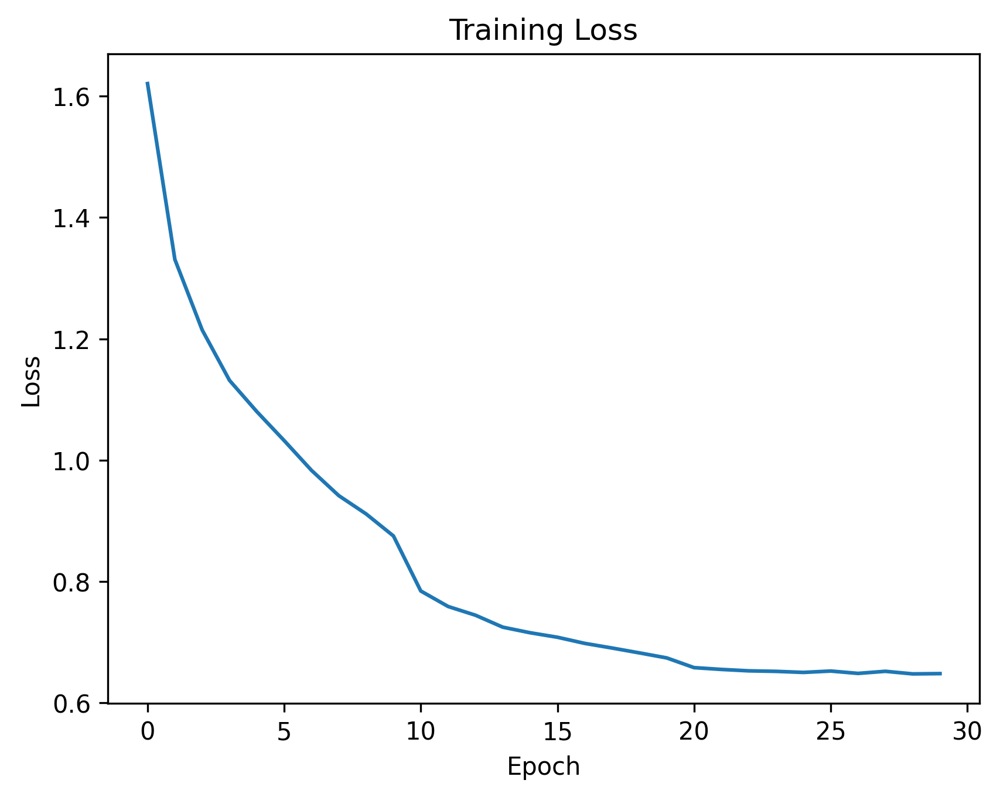
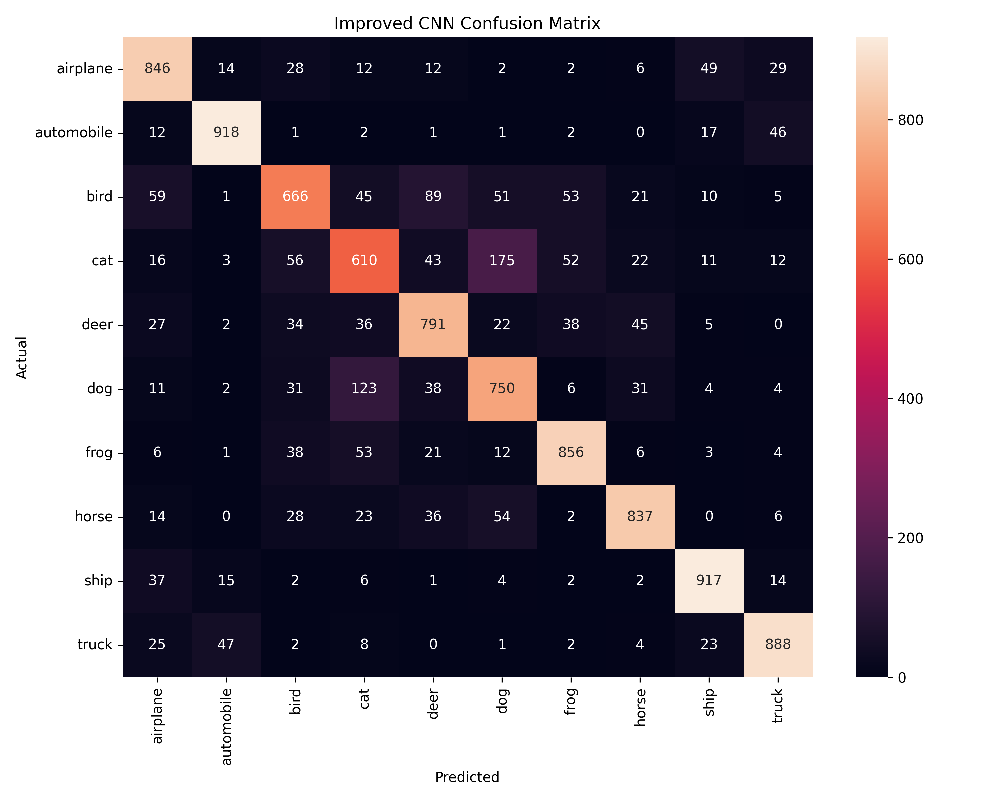
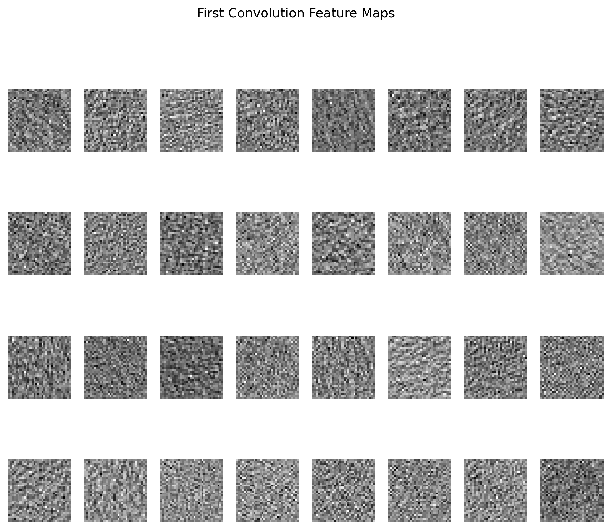

# CIFAR-10 Image Classification with Improved CNN (PyTorch)

A Computer Vision project implementing an improved Convolutional Neural Network using PyTorch for CIFAR-10 image classification.

The project demonstrates a complete deep learning workflow:

- Designing a CNN architecture from scratch
- Establishing a baseline model
- Improving model performance using modern techniques
- Training and evaluating a deep learning model
- Performing error analysis using Confusion Matrix
- Visualizing learned CNN features


---

# Project Overview

The objective of this project is to build and improve an image classification model for the CIFAR-10 dataset.

The first version of the project used a simple CNN architecture.  
The model was then improved by introducing regularization and optimization techniques:

- Batch Normalization
- Dropout
- Data Augmentation
- Weight Decay
- Learning Rate Scheduling


The focus of this project is not only achieving accuracy, but understanding the complete process:

```
Dataset
   ↓
Model Design
   ↓
Training
   ↓
Evaluation
   ↓
Error Analysis
   ↓
Model Improvement
```


---

# Dataset

The project uses the CIFAR-10 dataset.

Dataset characteristics:

| Property | Value |
|-|-|
| Number of Images | 60,000 |
| Image Size | 32 × 32 |
| Channels | RGB |
| Number of Classes | 10 |


Classes:

```
airplane
automobile
bird
cat
deer
dog
frog
horse
ship
truck
```


---

# Improved CNN Architecture

The final model is an improved CNN implemented from scratch using PyTorch.

Architecture:

```
Input Image
(3 × 32 × 32)

        |
        ↓

Conv2D
3 → 32 Channels

BatchNorm

ReLU

MaxPooling

        |
        ↓

Conv2D
32 → 64 Channels

BatchNorm

ReLU

MaxPooling

        |
        ↓

Conv2D
64 → 128 Channels

BatchNorm

ReLU

        |
        ↓

Flatten

Dropout(0.5)

Linear
8192 → 256

ReLU

Dropout(0.5)

Linear
256 → 10

        |
        ↓

Class Prediction
```


The implementation includes:

- Three convolutional blocks
- Batch Normalization after convolution layers
- Dropout regularization in classifier
- Ten output neurons for CIFAR-10 classes


---

# Improvements Over Baseline CNN

## 1. Batch Normalization

Added after convolution layers.

Benefits:

- More stable training
- Faster convergence
- Better gradient propagation


---

## 2. Data Augmentation

Training images are randomly modified using:

- Random Crop
- Random Horizontal Flip


Purpose:

- Increase data diversity
- Reduce overfitting
- Improve generalization


---

## 3. Dropout Regularization

Dropout probability:

```
0.5
```

Purpose:

- Prevent memorization
- Improve performance on unseen images


---

## 4. Weight Decay

Weight decay was added to Adam optimizer.

Purpose:

- Reduce model complexity
- Improve generalization


---

## 5. Learning Rate Scheduling

Learning rate is automatically reduced during training.

Purpose:

- Better optimization
- Improved final convergence


---

# Training Configuration

| Parameter | Value |
|-|-|
| Framework | PyTorch |
| Optimizer | Adam |
| Loss Function | Cross Entropy Loss |
| Batch Size | 64 |
| Initial Learning Rate | 0.001 |
| Epochs | 30 |
| Weight Decay | 1e-4 |
| Data Augmentation | Enabled |
| Device | CUDA if available |


---

# Training Result

The training loss shows a continuous decrease:

- Initial loss: approximately **1.62**
- Final loss: approximately **0.65**


Training curve:




The curve indicates:

- Successful optimization
- Stable convergence
- No significant training instability


---

# Model Evaluation

The trained model was evaluated on the CIFAR-10 test dataset.

## Final Accuracy

```
80.79%
```


Evaluation includes:

- Accuracy
- Classification Report
- Confusion Matrix


---

# Confusion Matrix Analysis




The diagonal values represent correctly classified samples.

Correct predictions:

| Class | Correct |
|-|-:|
| Airplane | 846 |
| Automobile | 918 |
| Bird | 666 |
| Cat | 610 |
| Deer | 791 |
| Dog | 750 |
| Frog | 856 |
| Horse | 837 |
| Ship | 917 |
| Truck | 888 |


Total correct predictions:

```
8079 / 10000
```


---

# Error Analysis

The confusion matrix shows that the model performs very well on:

- Automobile
- Ship
- Truck
- Frog
- Horse


Remaining difficult categories:

### Bird

Common confusion:

```
bird → deer
bird → dog
bird → frog
```


### Cat

Common confusion:

```
cat → dog
cat → bird
```


These errors are expected because CIFAR-10 images have:

- Low resolution (32×32)
- Limited visual details
- Similar object appearance between some classes


---

# Feature Visualization

Feature maps from the first convolution layer were extracted.




These features represent low-level visual patterns learned by CNN:

- Edges
- Textures
- Basic structures


Feature visualization helps understand how convolution layers transform raw pixels into meaningful representations.


---

# Project Structure

```
CIFAR10_CNN_Upgraded

│
├── model.py
│   └── ImprovedCNN architecture
│
├── train.py
│   └── Training pipeline
│
├── evaluate.py
│   └── Model evaluation
│
├── visualize.py
│   └── Feature map extraction
│
├── cifar10_improved_cnn.pth
│   └── Trained weights
│
└── results
    │
    ├── loss_curve.png
    ├── confusion_matrix.png
    └── features.png
```


---

# How to Run


## Install Dependencies

```bash
pip install torch torchvision matplotlib seaborn scikit-learn
```


## Train Model

```bash
python train.py
```


## Evaluate Model

```bash
python evaluate.py
```


## Visualize Features

```bash
python visualize.py
```


---

# Current Limitations

Although the model achieves good performance, this project is still a CNN developed from scratch.

It does not include:

- Transfer Learning
- ResNet architectures
- Hyperparameter optimization
- Advanced experiment tracking


---

# Future Improvements

Possible next steps:

- Implement ResNet18
- Compare CNN vs Transfer Learning
- Add TensorBoard monitoring
- Perform systematic experiments
- Apply stronger augmentation methods
- Use pretrained models


---

# Learning Outcomes

Through this project I practiced:

- CNN architecture design
- PyTorch training workflow
- Model improvement techniques
- Regularization methods
- Performance evaluation
- Error analysis
- Feature visualization


---

# Final Note

This project represents a step in my journey toward improving deep learning and computer vision skills.

The main achievement is not only reaching **80.79% accuracy**, but understanding how each improvement changes the behavior of a deep learning model.

The project follows a practical machine learning development cycle:

```
Baseline Model
      ↓
Identify Weaknesses
      ↓
Apply Improvements
      ↓
Evaluate Results
      ↓
Analyze Errors
      ↓
Continue Optimization
```